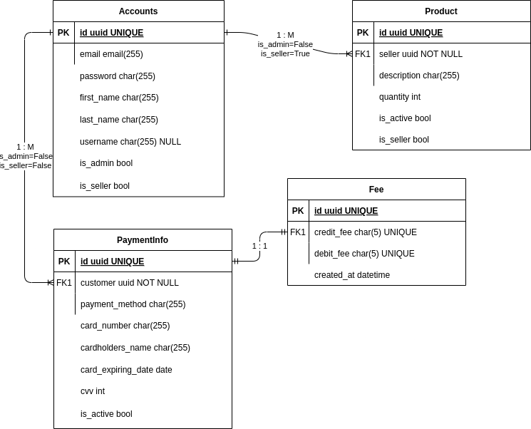

# PAGAR.ME

- [Translations](#translations)
- [About](#about)
- [Diagram](#diagram)
- [Description](#Description)
- [Instalation](#instalation)
- [Documentation](#documentation)
- [References](#references)
- [Terms_of_use](#terms_of_use)

<br>

## Translations

- [English](https://github.com/AndreKuratomi/pagar.me)
- [Português brasileiro / Brazilian portuguese](./.multilingual_readmes/README_pt-br.md)

<br>

## About

<p>The API <strong>Pagar.me</strong> is a simplified version of a market place and it is also a payment system where it is possible to buy products and process payments. This API uses python's framework <strong>Django</strong> and its <strong>Generic Views</strong>.</p>

<br>

## Description

The <b>Pagar.me</b> API works with 4 tables: Users (Accounts), products (Product), fees (Fee), and payments (PaymentInfo). Bellow a brief description of each one and its register rules:

USERS:

    Types:

        There are 3 types of users: Seller (seller), Administrador (admin) and the common user (the one who's neither admin nor seller).

    Permissons:

        - Only logged admin users may register another user and list them.
        - All logged users may update their own data.


PRODUCTS:

    Permissons:

        - Only logged seller users can register products and list them by id. 
        - A seller may list all of its registered products.

    Register rules:

        All products to be registered may have at least 1 copy.

FEES:

    Permissons:

        Only logged admin users can register fees and list them.

    Other info:

        - The default system fees are:

            Credit card - 5%
            Debit card - 3%

        - Fees cannot be deleted.

PAYMENT INFO:

    Permissons:

        Only logged users that are neither administradors nor sellers can register cards and list them.
    
    Register rules:

        - Card numbers out of the expiration date cannot be registered.
        - A card number may be registerd more than once if its payments metyhods are different (eg: credit or debit).
    
    Other info:

        - Only the last 4 card number digits are displayed.
        - As well as the user's password, the card's CVV is registered but not displayed.

Bellow the tables diagram:
<br>

## Diagram

<figure>
    
    <figcaption style="text-align: center">Table relationshipts</figcaption>
</figure>

<br>

## Instalation:

<h3>0. It is first necessary to have instaled the following devices:</h3>

- The code versioning <b>[Git](https://git-scm.com/downloads)</b>.

- A <b>code editor</b>, also known as <b>IDE</b>. For instance, <strong>[Visual Studio Code (VSCode)](https://code.visualstudio.com/)</strong>.

- A <b> client API REST </b> program. <strong>[Insomnia](https://insomnia.rest/download)</strong> or <b>[Postman](https://www.postman.com/product/rest-client/)</b>, for instance.

- <p> And versioning your directory to receive the aplication clone:</p>

```
git init
```

<br>
<h3>1. Clone the repository <b>pagar.me</b> by your machine terminal or by the IDE:</h3>

```
git clone https://github.com/AndreKuratomi/pagar.me.git
```

WINDOWS:

Obs: In case of any mistake similar to this one: 

```
unable to access 'https://github.com/AndreKuratomi/pagar.me.git/': SSL certificate problem: self-signed certificate in certificate chain
```

Configure git to disable SSL certification:

```
git config --global http.sslVerify "false"
```

<p>Enter the directory:</p>

```
cd pagar.me
```
<br>

<h3>2. After cloning the repository install:</h3>

<h4>Install virtual enviroment and update its dependencies with the following command:</h4>


LINUX:
```
python3 -m venv venv --upgrade-deps
```

WINDOWS:
```
py -m venv venv --upgrade-deps
```
<br>
<h4>Ativate your virtual enviroment with the command:</h4>

LINUX:
```
source venv/bin/activate
```

WINDOWS:

On Windows operational system it is necessary to configure the Execution Policy at PowerShell:

```
Get-ExecutionPolicy # to check the Execution policy type
Set-ExecutionPolicy RemoteSigned # to change the type of policy if the command above shows 'Restricted'
```
Obs: It may often be necessary to open PowerShell as administrador for that.

```
.\env\Scripts\activate
```
<br>
<h4>Install its dependencies:</h4>

```
pip install -r requirements.txt
```
<br>


WINDOWS:

In case any error similar to the one bellow be returned:

```
ERROR: Could not install packages due to an OSError: [Errno 2] No such file or directory: 'C:\\Users\\andre.kuratomi\\OneDrive - Company\\Área de Trabalho\\pagar.me\\pagar.me\\env\\Lib\\site-packages\\jedi\\third_party\\django-stubs\\django-stubs\\contrib\\contenttypes\\management\\commands\\remove_stale_contenttypes.pyi'
HINT: This error might have occurred since this system does not have Windows Long Path support enabled. You can find information on how to enable this at https://pip.pypa.io/warnings/enable-long-paths
```

Run cmd as adminstrador with the following command:

```
reg.exe add HKLM\SYSTEM\CurrentControlSet\Control\FileSystem /v LongPathsEnabled /t REG_DWORD /d 1 /f
```
<br>

<h3>3. Run the aplication with your IDE:</h3>

```
code .
```
<br>

<h3>4. And run django:</h3>

LINUX:
```
python manage.py runserver
```

WINDOWS:
```
py manage.py runserver
```
<br>


## Documentation

For full description of endpoints and its responses check the insomnia documentation on the link bellow:

https://pagar-5frujasuz-abkuras-projects.vercel.app/

<br>

## References

- [Django](https://www.djangoproject.com/)
- [Django Rest Framework](https://www.django-rest-framework.org/)
- [Generic views](https://www.django-rest-framework.org/api-guide/generic-views/)
- [Git](https://git-scm.com/downloads)
- [Insomnia-documenter](https://www.npmjs.com/package/insomnia-documenter)
- [Insomnia-documenter (quick tutorial)](https://www.youtube.com/watch?v=pq2u3FqVVy8)
- [Python](https://www.python.org/downloads/)
- [SQLite3](https://docs.python.org/3/library/sqlite3.html)
- [Visual Studio Code (VSCode)](https://code.visualstudio.com/)

<br>

## Terms_of_use

This project is exclusively for didatic purposes and has no commercial intent.
